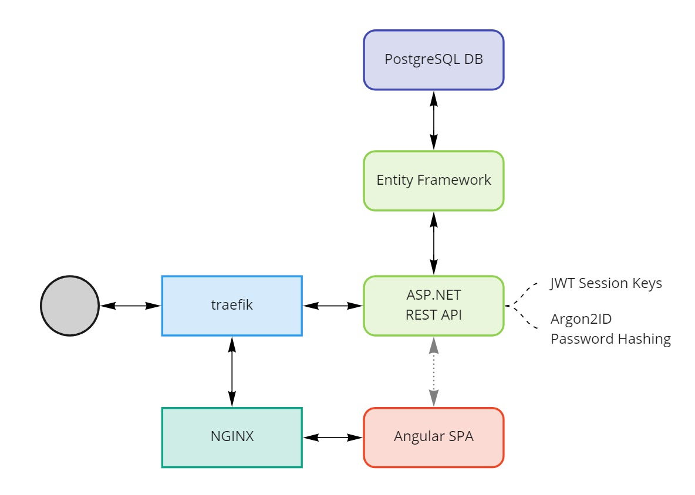

# No "Google" Challenge

## Inspiration

Recently, I read [this](https://web.eecs.utk.edu/~azh/blog/webappwithoutgoogling.html?s=09) article by Austin Z. Henley with the name "Can you make a basic web app without googling?". I mean, we all know as developers, the meme about this is kinda true. Everyone of us is familiar with google queries like "Get datetime in {language}".

I'm a web developer for around 3 years now. I've created numerous open source web applications *(which you can find on my [GitHub profile](https://github.com/zekrotja) if interested)*, created web applications for the company I am working with currently and played with various web frameworks, libraries and techniques like ASP.NET, fasthttp, gin, express, Angular, Vue, react, ...

So, I was really interested in this challenge. Am I able to create a simple web app - with the tools I'm working with on a daily basis - without any use of web search engines?

## The Challenge

Create a full stack todo web application without using any web search engines. You can use any framework, technology, language or whatever else you are comfortable with to create the web app.

It is allowed to use online documentation. Also, you are allowed to use simple searches to look for packages, dependencies, images, image resources, fonts or whatever.

**Just do not use any type of search engine to directly look for answers or solutions.**

### The Requirements

- A REST(ful) API to handle requests from the front end.
- A web application which displays the todo list and is used to create, modify, remove and check/uncheck entries.
- The app must have a persistent storage using any type of database you are free to chose.
- The app must be deployed on a server with all required stacks to run the app.

### Bonus Points

- User spaces with registration and authentication.
- Deployment using Docker and docker-compose (or kubernetes or something like that if you want).
- Using Continuous Deployment Pipelines.
- Make the web app actually look nice.

## My Approach

I have chosen to go with ASP.NET *(.NET 5)* as REST API framework in combination with the Entity Framework to bind to the database. ASP.NET + EF is a nice out-of-the-box solution and Microsoft provides great documentation for the .NET platform.

As database service, I've chosen to use PostgreSQL. It's free, fast, solid, easy to set up using Docker, well documented and the provided extension package for the Entity Framework works great.

For the web app, I am using Angular. It's a bit overkill, but it contains all important tools *(Ajax, Router, ...)*, it is well documented as well and I it's the framework I am using at my company and so I'm most confident with.

For user authentication, I'm using JWT to create session tokens and Argon2ID to hash passwords. These are *currently* the most state of the art techniques for user authentication and secure secrets storage.

To create a CD pipeline, I will use GitHub Actions. It's well integrated into GitHub, well documented, very fast and powerful and easy to set up.

To deploy the application and the database to my Linux VPS, I will use Docker and docker compose, because all used services are well integrated with Docker and the deployment is verry easy, especially because I have a lot of experiences working with these tools.

## My Results and Findings

> *soon*